# Laboratory Database Integrity

A MySQL relational-schema, integrity-validation and database-testing project for laboratory operations.

## Overview

The project models laboratory resources, reservations, attendance, equipment, repairs and transfers. Its focus is the correctness of relational data and database operations, with a small Python CLI and reproducible automated tests.

## What this project demonstrates

- Normalized identity, role and operational records with explicit PK, FK, UNIQUE, CHECK and NULL semantics.
- Safe non-destructive initialization and deterministic synthetic data.
- Read-only structural and cross-table consistency verification.
- Atomic equipment transfers, row locking, concurrent updates and uncertain commit outcomes.

## Data model

**22 tables · 124 columns · 22 primary keys · 38 foreign keys · 4 additional UNIQUE constraints · 68 CHECK constraints**

[](assets/er-diagram.svg)

Open the SVG to zoom into the physical model. The [Mermaid source](assets/er-diagram.mmd) is maintainable; the [schema reference](docs/schema-reference.md) explains every table, column and relationship. [`sql/schema.sql`](sql/schema.sql) is the authority.

## Integrity design

All tables use InnoDB, utf8mb4 and utf8mb4_0900_as_cs. All foreign keys use `ON UPDATE RESTRICT ON DELETE RESTRICT`. Shared user identity supports both student and teacher roles; laboratory managers extend the teacher role. Check-ins reference reservations, and violation evidence is tied to the same reservation through a composite FK.

CHECK constraints express row-local rules. Cross-table rules are checked separately. Student-by-term remaining points are derived with a zero floor by [`sql/queries.sql`](sql/queries.sql), rather than stored as a mutable balance. See [design decisions](docs/design-decisions.md).

## Safe initialization

`init` accepts an existing, dedicated database whose name matches `labdb_[a-z0-9_]+` and contains no tables or views. It creates the schema and checks an independent metadata contract. It never creates, drops, clears or resets a database. MySQL DDL can commit implicitly: an execution failure may leave partial structure, reported without automatic cleanup.

## Deterministic seed data

`seed` inserts **68 deterministic synthetic rows across all 22 tables**. It requires the exact schema and empty business tables, then checks row counts and business consistency before commit. It refuses repeat seeding and does not merge or overwrite data. The suite verifies rollback of an injected INSERT failure.

## Consistency verification

`verify` runs in a consistent read-only transaction. It reports `S01_SCHEMA_DRIFT` for structural differences, or evaluates V01–V16 when structure matches. Results contain stable codes, entity IDs and deterministic ordering. Verification does not modify or repair data. The [rule catalog](docs/testing.md#verification-rule-catalog) describes the checks and their boundaries.

## Transaction correctness

`transfer` locks the equipment row with `SELECT ... FOR UPDATE`, rejects a stale source, locks the target laboratory with `FOR SHARE`, then updates current location and inserts history in one transaction. Pre-commit failures trigger rollback; there is no automatic retry. Existing caller transactions are refused without committing or rolling them back.

A lost commit acknowledgement produces `COMMIT_OUTCOME_UNKNOWN`. The Python helper `reconcile_transfer_for_config` checks the stable transfer ID using a new connection before a recovery decision. It distinguishes a matching committed record, no record found and an ID conflict; absence alone is not permission to replay. History is immutable within the transfer operation: existing history rows are never edited. See [transaction boundaries](docs/design-decisions.md#equipment-transfer-and-reconciliation).

## CLI

Both `labdb` and `python -m labdb.cli` expose these commands:

| Command | Success | Refusal / finding | Execution or configuration error |
|---|---|---|---|
| `init` | 0 | 1 | 1 |
| `seed` | 0 | 1 | 1 |
| `verify` | 0 | 1: integrity violations | 2 |
| `transfer` | 0 | 1: domain refusal | 2, including unknown commit outcome |

Missing or invalid command-line arguments exit with code 2. Reconciliation is a Python helper, not a CLI subcommand.

## Testing

The full test suite has been validated with **120 collected, 120 passed, 0 failed and 0 skipped** on Python 3.12.10 and Python 3.13.5 against MySQL 8.4.11. Local CI-equivalent validation also passed.

Python 3.12 is the primary validated runtime. Python 3.13 is a validated compatibility target.

The [GitHub Actions workflow](.github/workflows/ci.yml) defines a Python 3.12/3.13 matrix and enforces zero skips. **Hosted GitHub Actions has not yet been executed.** See [testing and reproduction](docs/testing.md) for coverage, database preparation and evidence scope.

## Project structure

```text
sql/                   Schema, deterministic seed and derived points query
src/labdb/             Configuration, lifecycle, verification, transfers and CLI
tests/                 Unit, contract, CLI and packaging tests
  integration/         Tests against a disposable MySQL database
docs/                  Schema, decisions, testing and limitations
assets/                Mermaid ER source and rendered SVG
.github/workflows/      Automated validation workflow
requirements.lock      Exact dependency pins
pyproject.toml         Package metadata and test configuration
```

## Documentation

- [Schema reference](docs/schema-reference.md): physical dictionary and ER notation.
- [Design decisions](docs/design-decisions.md): rationale and enforcement boundaries.
- [Testing](docs/testing.md): coverage, validated results and reproducible commands.
- [Limitations](docs/limitations.md): supported scope and operational assumptions.

## Requirements / environment

- Python 3.12.10: primary validated runtime; Python 3.13.5: validated compatibility target.
- MySQL 8.4.11: validated server version.
- PyMySQL 1.1.1 and pytest 8.3.4, with dependencies pinned in `requirements.lock`.
- A source checkout with its `sql/` directory and a deliberately provisioned empty `labdb_*` database. Local operation does not require Docker; the workflow uses it for isolated validation.

## Quick start

From the project root, select Python 3.12 and create a virtual environment:

```text
python -m venv .venv
```

Activate it with `.venv\Scripts\Activate.ps1` in PowerShell, or `source .venv/bin/activate` in a POSIX shell, then run:

```text
python -m pip install -r requirements.lock
python -m pip install --no-deps --no-build-isolation -e .
python -m pip check
python -m labdb.cli --help
```

Provision the empty database separately, using utf8mb4 / utf8mb4_0900_as_cs. Supply `LABDB_HOST`, `LABDB_PORT`, `LABDB_USER`, `LABDB_PASSWORD` and `LABDB_DATABASE` as process environment variables. [`.env.example`](.env.example) lists empty placeholders; the application does **not** automatically load `.env` files. The port must be 1–65535. Use the scoped privileges described in the [testing guide](docs/testing.md#database-preparation).

```text
python -m labdb.cli init
python -m labdb.cli seed
python -m labdb.cli verify
python -m labdb.cli transfer --transfer-id MOVE_NEW_01 --equipment-id EQ_TEST_02 --source-lab-id LAB_TEST_A1 --target-lab-id LAB_TEST_A2 --reason "controlled relocation"
python -m labdb.cli verify
```

The transfer example applies once to the canonical seed. Reusing its ID or stale source is refused. Run the full suite against a **separate fresh disposable database**, following [testing.md](docs/testing.md); do not point integration tests at this populated quick-start database.

## Limitations

This is a database-centric project with no Web UI, REST API, authentication system or scheduling service. Verification covers a defined rule set; it is not a general integrity proof or production deployment framework. [Limitations](docs/limitations.md) also covers packaging, timestamp, schema-drift and transaction boundaries.
